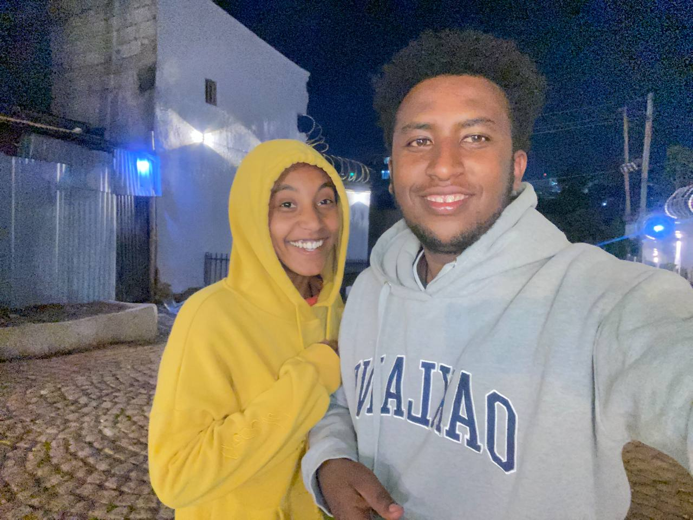
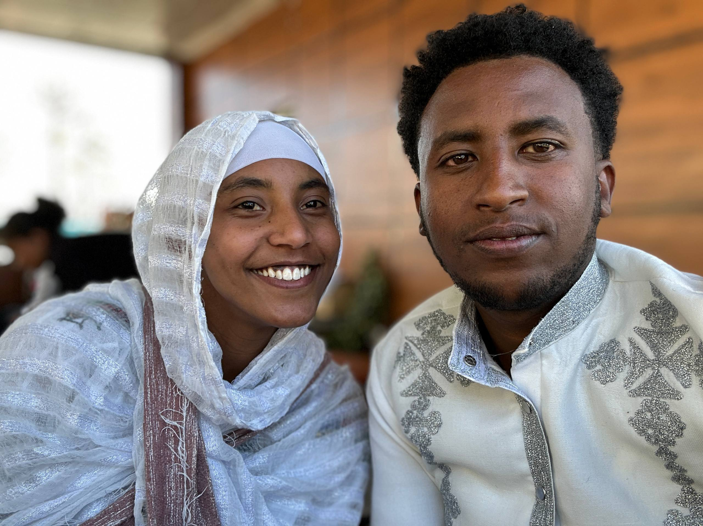
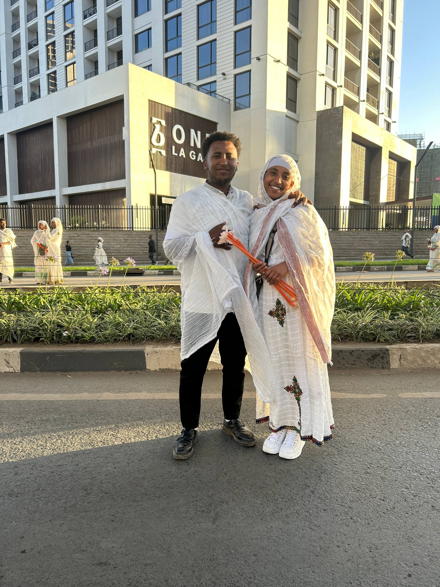

<html lang="am">
<head>
<meta charset="UTF-8">
<meta name="viewport" content="width=device-width, initial-scale=1.0">
<title>አፈቅርሻለሁ ርግቤ</title>

</head>
<body>

<!-- Landing Section -->
<section class="flex flex-col items-center justify-center min-h-screen text-center px-4">
  <h1 class="text-5xl md:text-7xl font-extrabold mb-6 text-yellow-400">አፈቅርሻለሁ ርግቤ</h1>
  
Experience cinematic Ethiopian love 💖

  <button class="glass-button" id="startBtn">Start Journey</button>
</section>

<!-- Photo Section -->
<section id="photoSection" class="hidden flex flex-col items-center justify-center min-h-screen gap-8 px-4">
  

    
    
    
  

  

    <button class="glass-button" id="prevBtn">Previous</button>
    <button class="glass-button" id="nextBtn">Next</button>
  

</section>

<!-- Closing Section -->
<section id="closingSection" class="hidden flex flex-col items-center justify-center min-h-screen text-center px-4">
  <h2 class="text-4xl md:text-6xl font-bold mb-6 animate-pulse text-red-500">አፈቅርሻለሁ ርግቤ 💕</h2>
  
You are my heart, my dove, my everything.

  <button class="glass-button mt-10" onclick="location.reload()">Replay</button>
</section>

</body>
</html>
